# Image Calculator

Aplicación de procesamiento digital de imágenes desarrollada en C++ para comprender el manejo de píxeles y transformaciones de imágenes desde bajo nivel.  
Las operaciones se implementan manualmente mediante acceso directo a memoria y recorridos con bucles `for`, evitando el uso de funciones internas de procesamiento de OpenCV.

---

# Preview

## Interfaz
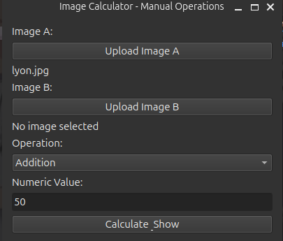

## Operaciones implementadas

| Operación | Entrada 1 | Entrada 2 | Resultado |
|---|---|---|---|
| Negativo | 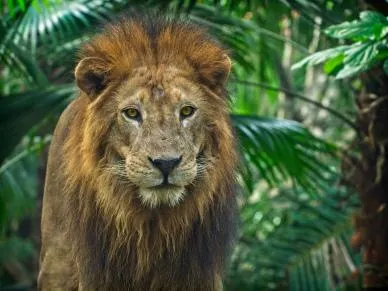 |  | 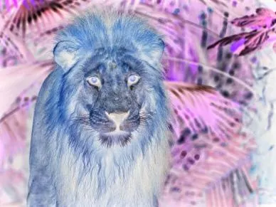 |
| Watermark |  | 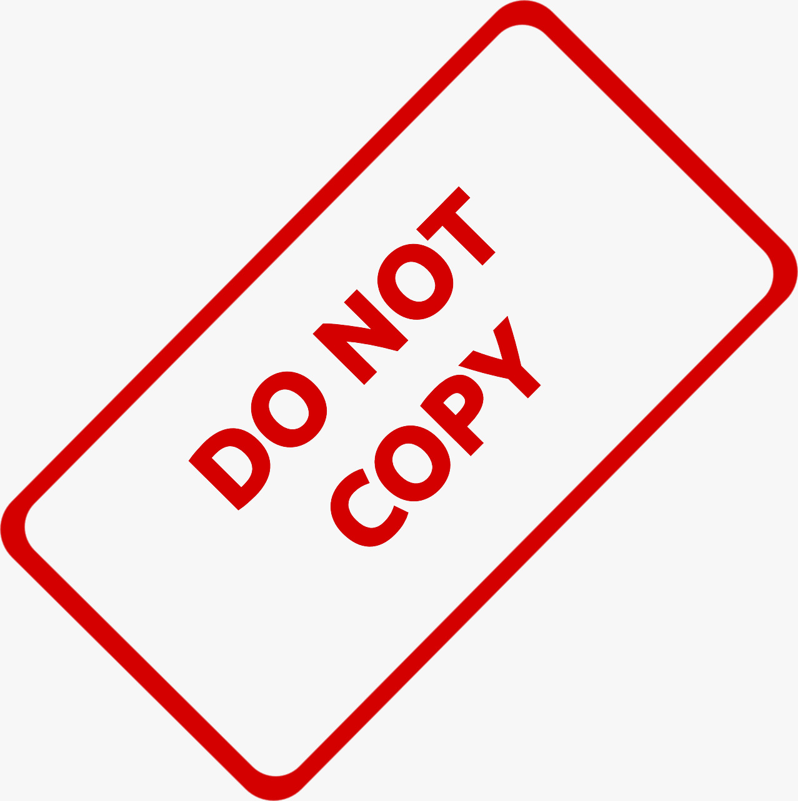 |  |
| Rotación |  | | 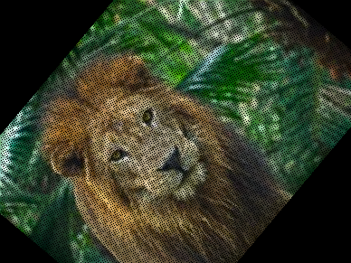 |
| XOR | 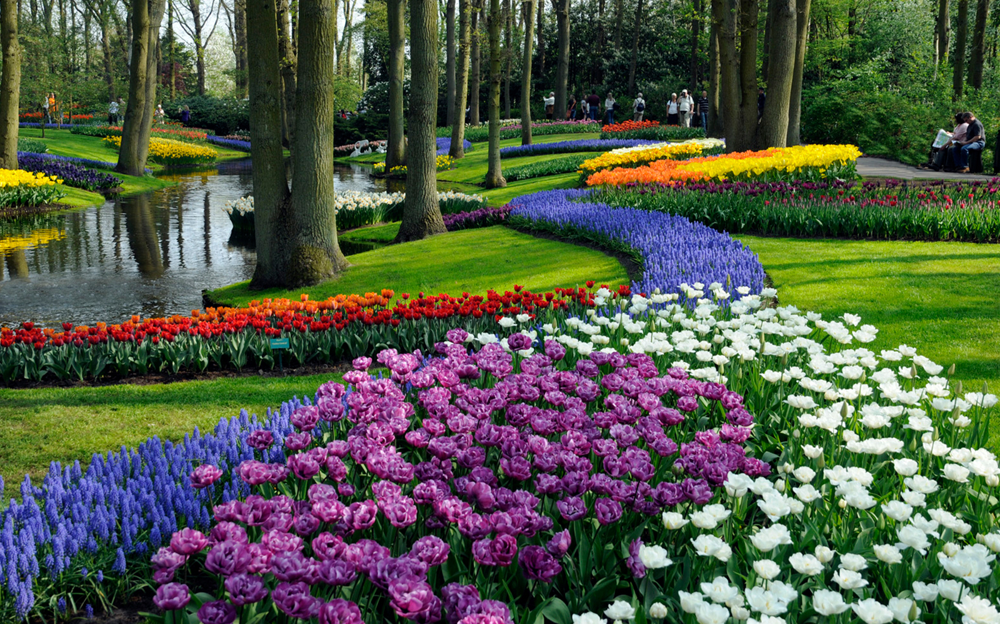 | 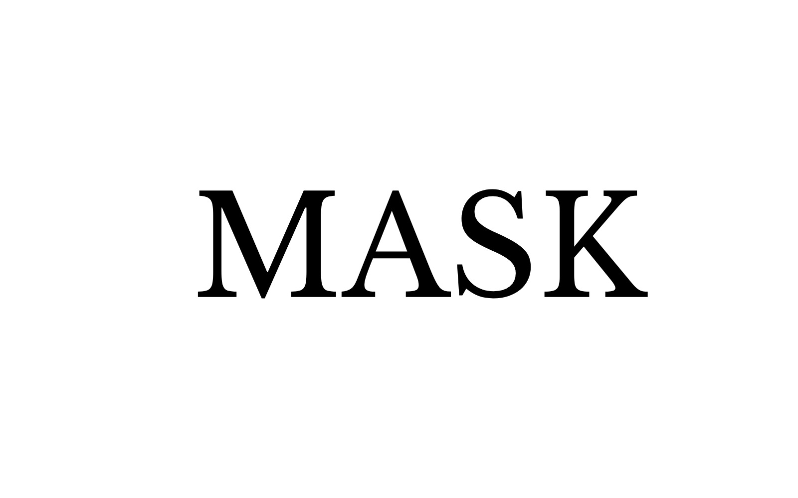 | 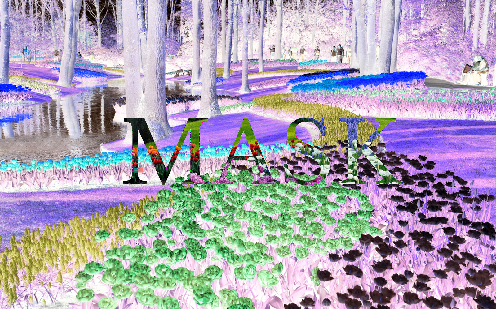 |
| Substraction | 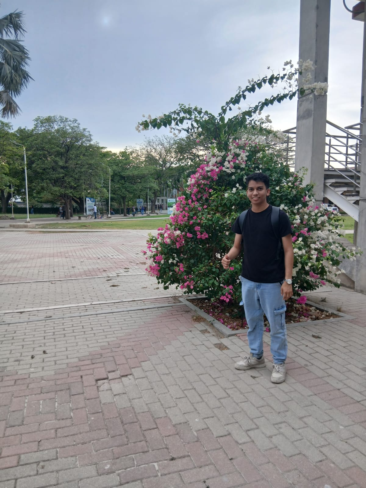 | 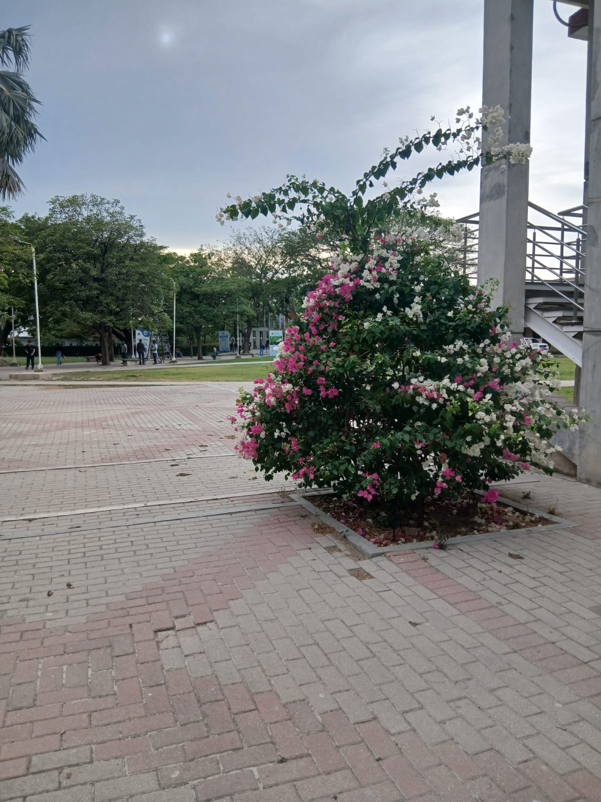 | 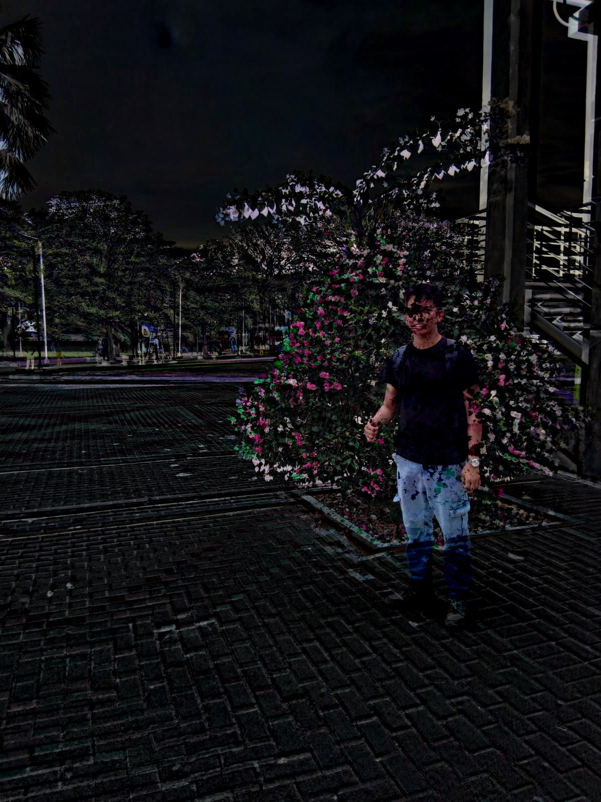 |

---

# Características

- Implementación manual de operaciones sobre imágenes.
- Procesamiento por canal (BGR y escala de grises).
- Interfaz gráfica desarrollada con Qt6.
- Uso de OpenCV únicamente para carga y guardado de imágenes.
- Transformaciones aritméticas, lógicas y geométricas.

---

# Tecnologías

- C++17
- Qt6
- OpenCV 4.x
- CMake

---

# Operaciones Disponibles

## Aritméticas
- Suma
- Resta
- Multiplicación
- División
- Escalado de brillo
- Raíz cuadrada
- Watermark / Alpha Blending

## Lógicas
- AND
- OR
- XOR
- Negativo

## Geométricas
- Traslación
- Rotación
- Espejo horizontal y vertical

---

# Estructura del Proyecto

```text
include/   -> Definiciones y cabeceras
src/       -> Implementación y GUI
assets/    -> Recursos e imágenes del README
images/    -> Imágenes de prueba
```

---

# Requisitos

- OpenCV 4.x
- Qt6
- CMake 3.10+
- Compilador compatible con C++17

---

# Compilación

```bash
mkdir build && cd build

cmake ..
make

./app
```

---

# Uso

1. Cargar la imagen principal.
2. Cargar una segunda imagen para operaciones binarias.
3. Seleccionar la operación.
4. Ajustar parámetros numéricos si aplica.
5. Ejecutar y visualizar el resultado.

---

Proyecto orientado al aprendizaje de la materia Análisis automático de imágenes mediante implementación manual de algoritmos.
